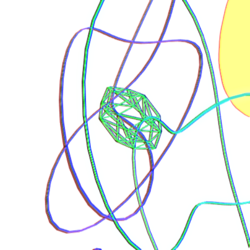
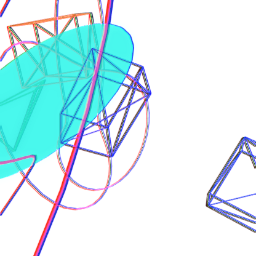
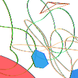

# Identicon Generator Site: A Deep Dive into 3D Geometric Identity Visualization

Author: [Alif Jakir](https://www.alifjakir.com) | [GitHub](https://github.com/Caerii)

[Visit the Live Identicon Generator Site!](https://main.d1pgdiynavmgi2.amplifyapp.com/)

Updated 7/12/24!

The string "wall"


The string "cognition"


The string "Jane"


## Table of Contents
1. [Introduction](#introduction)
   - [Getting Started](#getting-started)
     - [Live Demo](#live-demo)
     - [Local Installation](#local-installation)
2. [Background and Motivation](#background-and-motivation)
3. [What are Identicons?](#what-are-identicons)
   - [Traditional Identicons](#traditional-identicons)
   - [Our 3D Geometric Approach](#our-3d-geometric-approach)
4. [Project Objectives](#project-objectives)
5. [Technical Implementation](#technical-implementation)
   - [Algorithm Design](#algorithm-design)
     - [Hash Generation](#hash-generation)
     - [Geometry Creation](#geometry-creation)
     - [Color Selection](#color-selection)
     - [Position and Rotation](#position-and-rotation)
   - [Technology Stack](#technology-stack)
   - [Key Components](#key-components)
     - [MainContent.tsx](#maincontenttsx)
     - [GeometricIdenticon.tsx](#geometricidenticontsx)
     - [Sidebar.tsx](#sidebartsx)
     - [utils.tsx](#utilstsx)
6. [Detailed Feature Breakdown](#detailed-feature-breakdown)
7. [Performance Considerations](#performance-considerations)
8. [User Experience Design](#user-experience-design)
9. [Future Enhancements](#future-enhancements)
10. [Development Workflow](#development-workflow)
11. [Contributing](#contributing)
12. [License](#license)


## Introduction

The Identicon Generator Site is an innovative web application that pushes the boundaries of digital identity visualization. By generating unique, three-dimensional geometric identicons, we provide a novel solution to the challenge of user identification in digital spaces. This project combines algorithmic creativity with modern web technologies to create a visually striking and functionally robust system for generating user avatars.

Our identicon generator offers a range of features, including real-time identicon generation based on user input, predefined user examples, interactive 3D views, and downloadable identicons. By leveraging the power of React, Three.js, and Tailwind CSS, we've created an application that is both visually appealing and performant.

In this document, we'll explore the technical implementation of our identicon generator, the underlying algorithm design, the technology stack we've used, and the key components that make up the application. We'll also discuss the project's objectives, performance considerations, user experience design, and future enhancements.

For future development, the hashing and cryptographic elements would be moved to a serverless backend to ensure user privacy and security, the current application is only for illustrative purposes and should not be used for deployment at scale. Additionally, the 3D rendering could be further optimized for performance and scalability.

## Getting Started

### Live Demo

I hosted a demo of this on AWS Amplify which integrates continuous integration, you can visit the site by clicking the link below:

[Visit the Identicon Generator Site](https://main.d1pgdiynavmgi2.amplifyapp.com/)

### Local Installation

To run the Identicon Generator Site locally, follow these steps:

1. **Clone the Repository:**
   ```sh
   git clone https://github.com/Caerii/Identicon-Generator-Site.git
   cd identicon-frontend
   ```

2. **Install Dependencies:**
   ```sh
   npm install
   ```

3. **Run the Development Server:**
   ```sh
   npm run dev
   ```

4. **Open Your Browser:**
   Navigate to `http://localhost:3000` to view the identicon generator in action.

## Background and Motivation

User interfaces in digital paradigms require a visual representation of user identity, adoption of automation and privacy for this has become increasingly important. Traditional methods like profile pictures often require user input and can lead to privacy concerns. Automatically generated identicons offer a solution, providing unique visual identifiers without requiring personal information.

Our motivation for this project stems from a desire to enhance the concept of identicons by leveraging modern web technologies and 3D graphics. By moving beyond traditional 2D pixel-based identicons, we aim to create more memorable, visually appealing, and informationally rich identity representations.

## What are Identicons?

### Traditional Identicons

Identicons, first introduced by Don Park in 2007, are visual representations of a hash value. Typically, they're used to provide a unique avatar for users in various digital platforms. Traditional identicons often take the form of 2D pixel art, generated based on the hash of a user's IP address or username.

### Our 3D Geometric Approach

Our project takes the concept of identicons into three-dimensional space. Instead of flat, pixel-based images, we generate complex 3D geometric shapes. Users will be more impressed with such an approach, depending on the primitives used. We used topological primitives here to make everything reproducible with standard methods. However, future interfaces might allow users to upload their own primitives, or describe it merely in natural language. This approach we use, with real-time 3D offers several advantages:

1. **Increased Uniqueness**: The additional dimension and geometric complexity allow for a vastly larger set of unique identicons.
2. **Enhanced Memorability**: 3D shapes are often more distinctive and memorable than 2D patterns.
3. **Interactive Potential**: Users can rotate and explore their 3D identicons, increasing engagement.
4. **Scalability**: 3D models can be rendered at any resolution without loss of quality.

## Project Objectives

Our identicon generation system aims to achieve the following objectives:

1. **Legibility at Various Scales**: 
   - **Why**: Identicons need to be recognizable whether displayed as a small avatar or a large profile picture.
   - **How**: We achieve this by using simple geometric shapes and high-contrast colors, ensuring that the essential features of each identicon remain distinct at different sizes.

2. **Uniqueness vs. Similarity**: 
   - **Why**: Each identicon should be distinct, but there should also be visible similarities between identicons generated from similar inputs.
   - **How**: Our algorithm uses a SHA-256 hash function, which ensures that even small changes in input produce significantly different outputs. However, we map certain aspects of the hash to specific properties (like color or shape type) to maintain some consistency.

3. **Aesthetic Appeal**: 
   - **Why**: Visually pleasing identicons enhance user experience and platform aesthetics.
   - **How**: We use a combination of carefully selected color palettes, harmonious geometric shapes, and subtle visual effects like bloom and chromatic aberration.

4. **Performance and Efficiency**: 
   - **Why**: Quick generation and rendering of identicons is crucial for a smooth user experience, especially when displaying multiple identicons (e.g., in a forum view).
   - **How**: We optimize our 3D rendering using React Three Fiber, implement efficient hash-to-geometry mapping algorithms, and use React's state management for smooth updates.

5. **User Interaction**:
    - **Why**: Interactive elements increase user engagement and allow for exploration of the 3D identicons.
    - **How**: We provide rotation controls for users to interact with their identicons, enhancing the overall user experience.

6. **3D Visualization**:
    - **Why**: 3D identicons offer a modern and visually striking alternative to traditional 2D avatars.
    - **How**: We leverage Three.js and React Three Fiber to create and render complex 3D geometries in the browser.

7. **Real-World Application**:
    - **Why**: Demonstrating the practical use of identicons in a forum-like setting provides context for their utility.
    - **How**: We include a sidebar with predefined users and their associated identicons, showcasing how identicons might be used in a user list.

## Technical Implementation

### Algorithm Design

#### Hash Generation

We use the SHA-256 algorithm to convert input strings (like usernames) into numerical values. This cryptographic hash function ensures that even small changes in the input result in significantly different hash values.

```typescript
export const generateHash = (inputString: string, index: number): string => {
  const concatenatedString = inputString + index;
  const hash = CryptoJS.SHA256(concatenatedString);
  return hash.toString();
};
```

**Why SHA-256?**: 
- It provides a fixed-size output (256 bits), which is convenient for our purposes.
- It has strong collision resistance, meaning it's extremely unlikely to generate the same hash for different inputs.
- It's widely used and well-tested, providing reliability and security.

#### Geometry Creation

The `GeometricIdenticon` component is responsible for creating the 3D geometry based on the hash. We use a combination of different Three.js geometries to create varied and interesting shapes.

```typescript
const geometries = [
  <boxGeometry args={[1, 1, 1]} key="box" />,
  <sphereGeometry args={[1.5, 32, 32]} key="sphere" />,
  <coneGeometry args={[0.5, 1, 32]} key="cone" />,
  <torusKnotGeometry args={[1.5, 0.01, 100, 16]} key="torusKnot" />,
  <dodecahedronGeometry args={[0.75, 0]} key="dodecahedron" />,
  <octahedronGeometry args={[0.75, 0]} key="octahedron" />,
  <tetrahedronGeometry args={[0.75, 0]} key="tetrahedron" />,
];

const typeIndex = useMemo(() => Math.floor(getRandomValue(hash, 0, geometries.length)), [hash]);
```

**Why this approach?**: 
- Using different geometries provides visual variety.
- The modular approach allows easy addition or removal of geometry types.
- Memoization of the type index ensures consistent geometry selection for the same hash.

#### Color Selection

We generate colors in HSL format based on the hash value. This allows for a wide range of visually pleasing colors while maintaining consistency for similar inputs.

```typescript
const getColorFromHash = (hash: string, index: number) => `hsl(${getRandomValue(hash, index, 360)}, 70%, 50%)`;
```

**Why HSL?**: 
- HSL (Hue, Saturation, Lightness) allows for more intuitive color generation compared to RGB.
- We can easily ensure good contrast by fixing saturation and lightness while varying the hue.

#### Position and Rotation

The position and rotation of each geometric element are determined by different parts of the hash value.

```typescript
const position = useMemo(() => new Vector3(
  getRandomValue(hash, 1, 10) - 5,
  getRandomValue(hash, 2, 10) - 5,
  getRandomValue(hash, 3, 10) - 5
), [hash]);

const rotation = useMemo(() => new Euler(
  getRandomValue(hash, 8, Math.PI * 2),
  getRandomValue(hash, 9, Math.PI * 2),
  getRandomValue(hash, 10, Math.PI * 2)
), [hash]);
```

**Why this method?**: 
- It ensures that different parts of the hash influence different aspects of the identicon.
- The use of `useMemo` optimizes performance by only recalculating when the hash changes.

### Technology Stack

- **React**: Chosen for its component-based architecture and efficient rendering through the virtual DOM.
- **Three.js and React Three Fiber**: Enables complex 3D rendering in the browser with a React-friendly API.
- **Next.js**: Provides server-side rendering capabilities and optimized production builds. We didn't implement all of these features in this small project, but they are available for future development.
- **Tailwind CSS**: Allows for rapid UI development with utility-first CSS.

**Why this stack?**: 
- React's component model aligns well with our modular identicon generation approach. We can easily reuse components and manage state.
- Three.js is the industry standard for 3D graphics in the browser. React Three Fiber makes it easy to integrate Three.js with React.
- Next.js enhances performance and SEO capabilities. We can easily add server-side rendering and API routes for future enhancements.
- Tailwind CSS enables quick styling iterations and maintains a consistent design language. It's also easy to customize and extend.

### Key Components

#### MainContent.tsx

This component serves as the primary interface for the application. It manages the state for identicon generation and renders the 3D scene.

Key features:
- Handles user input for identicon generation.
- Manages rotation state of identicons.
- Integrates Canvas and post-processing effects.

```typescript
const MainContent: React.FC<MainContentProps> = ({
  inputString, 
  handleInputChange, 
  setSeed, 
  rotate, 
  setRotate, 
  seed, 
  canvasRefs, 
  setIsTyping
}) => {
  // ... component logic ...
}
```

**Why this structure?**: 
- Separating the main content into its own component allows for better organization and potential reusability.
- Props are used to manage state, allowing for a clear data flow and easier debugging.

#### GeometricIdenticon.tsx

This component is responsible for creating individual 3D mesh objects that make up an identicon.

Key features:
- Generates 3D geometry based on input hash.
- Applies material properties including color and transparency.
- Manages rotation animation.

```typescript
const GeometricIdenticon = ({ seed, rotate }: { seed: string, rotate: boolean }) => {
  // ... component logic ...
}
```

**Why this approach?**: 
- Encapsulating the identicon generation logic in a separate component allows for easy reuse and testing.
- The use of React hooks (`useMemo`, `useFrame`) optimizes performance and manages side effects efficiently.

#### Sidebar.tsx

This component displays a list of forum posts along with their corresponding identicons, demonstrating a practical application of the identicon system.

Key features:
- Renders a list of forum posts with associated identicons.
- Provides functionality to download identicons.
- Manages dropdown menus for each post.

```typescript
const Sidebar: React.FC<SidebarProps> = ({ forumPosts, rotate, setDropdownVisible, dropdownVisible, canvasRefs }) => {
  // ... component logic ...
}
```

**Why this design?**: 
- The sidebar provides a real-world context for how identicons might be used in a forum-like setting.
- It demonstrates the scalability of our identicon system by rendering multiple identicons simultaneously.

#### utils.tsx

Contains utility functions for hash generation and identicon capture/download functionality.

Key features:
- Generates SHA-256 hash from input string.
- Captures and downloads identicons as PNG files.

```typescript
export const generateHash = (inputString: string, index: number): string => {
  // ... hash generation logic ...
};

export const captureIdenticon = (index: number, size: number, canvasRefs: React.MutableRefObject<(HTMLDivElement | null)[]>) => {
  // ... identicon capture and download logic ...
};
```

**Why separate utils?**: 
- Separating these functions into a utilities file promotes code reusability and maintains a clean structure in the main components.
- It allows for easier unit testing of these pure functions.

## Detailed Feature Breakdown

1. **Dynamic Identicon Generation**: 
   - **How it works**: The `MainContent` component takes user input, generates a hash, and passes it to the `GeometricIdenticon` component.
   - **Why it's important**: Allows users to see how their input affects the generated identicon in real-time.

2. **Predefined Users**: 
   - **How it works**: The `Sidebar` component renders a list of predefined users with their identicons.
   - **Why it's important**: Demonstrates the practical application of identicons in a user list or forum setting.

3. **Visual Effects**: 
   - **How it works**: We use `EffectComposer` from `@react-three/postprocessing` to add Bloom and Chromatic Aberration effects.
   - **Why it's important**: Enhances the visual appeal of the identicons, making them more distinctive and memorable.

4. **Interactive 3D View**: 
   - **How it works**: We use `OrbitControls` from `@react-three/drei` to allow user interaction with the 3D scene.
   - **Why it's important**: Increases user engagement and allows for exploration of the 3D identicons.

5. **Downloadable Identicons**: 
   - **How it works**: The `captureIdenticon` function in `utils.tsx` captures the canvas content and triggers a download.
   - **Why it's important**: Allows users to save and use their generated identicons outside of the application.

## Performance Considerations

- **Use of `useMemo`**: We extensively use `useMemo` to memoize computationally expensive operations, ensuring they only recompute when their dependencies change.
- **Efficient Rendering**: React Three Fiber optimizes 3D rendering by only updating what's necessary.
- **Modular Design**: Our component-based architecture allows for efficient updates and renders.

## User Experience Design

- **Intuitive Interface**: The main input field is prominently displayed, with immediate visual feedback as users type.
- **Interactive Elements**: Users can rotate and explore their 3D identicons, enhancing engagement.
- **Responsive Design**: The application is designed to work primarily on desktops, future versions might include mobile optimization.

## Future Enhancements

1. **Customization Options**: Allow users to choose color schemes or influence the type of geometry generated.
2. **Animation Presets**: Introduce different animation options for identicon display.
3. **Backend Integration**: Implement server-side generation and caching of identicons for improved performance.
4. **Accessibility Features**: Enhance keyboard navigation and add screen reader support.

## Development Workflow

1. **Version Control**: We use Git for version control, with a branching strategy that includes feature branches and pull requests.
2. **Code Review**: All changes undergo peer review (with or without a human) before merging into the main branch.
  -> The usage of AI in this project has helped to refine pseudocode into more complex functional components, and greatly accelerates the development process.
3. **Testing**: In this small application we use manual testing, but in a larger project we would implement unit tests and end-to-end tests.
4. **Continuous Integration**: We use GitHub Actions for automated testing and deployment.

## Contributing

We welcome contributions to the Identicon Generator Site! Here's how you can contribute:

1. Fork the repository
2. Create a new branch (`git checkout -b feature/AmazingFeature`)
3. Make your changes
4. Commit your changes (`git commit -m 'Add some AmazingFeature'`)
5. Push to the branch (`git push origin feature/AmazingFeature`)
6. Open a Pull Request

Please ensure your code adheres to our coding standards and includes appropriate tests.

## License

This project is licensed under the MIT License. See the [LICENSE](LICENSE) file for details.